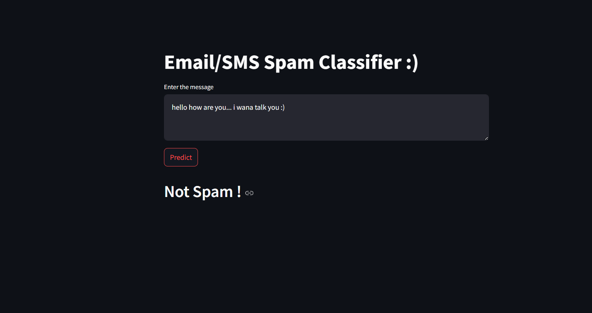

# 📩 SMS/Email Spam Classifier

🚀 **An intelligent spam detection system to classify messages as Spam or Not Spam** 🚀

---

## 🌟 Overview
This project is a **SMS/Email Spam Classifier** built using **Machine Learning**. The model predicts whether a given message is **Spam** or **Not Spam**. It is deployed as a web app using **Streamlit**.

## ✨ Features
✅ **User Input:** Accepts text messages (SMS/Email) for classification.  
✅ **Text Preprocessing:** Cleans and transforms input text.  
✅ **Vectorization:** Converts text into numerical format using `TfidfVectorizer`.  
✅ **Prediction:** Uses a trained model to classify messages as **Spam** or **Not Spam**.  
✅ **Interactive UI:** Simple web-based interface using **Streamlit**.  

---

## 🛠 Tech Stack
- 🐍 **Python**
- 🎨 **Streamlit** (for web interface)
- 📝 **NLTK** (for text preprocessing)
- 🤖 **Scikit-learn** (for ML model)
- 💾 **Pickle** (for saving and loading model/vectorizer)

## 📌 Installation
### Prerequisites
Make sure you have the following installed:
- ✅ Python 3.x
- ✅ pip

### Install Dependencies
Run the following command to install required libraries:
```sh
pip install streamlit scikit-learn nltk pickle-mixin
```

---

## 🚀 How to Run the Application
1. **Clone the repository:**
   ```sh
   git clone https://github.com/your-username/sms-classifiermodel.git
   cd sms-classifiermodel
   ```
2. **Download the required NLTK data:**
   ```python
   import nltk
   nltk.download('punkt')
   nltk.download('stopwords')
   ```
3. **Run the Streamlit app:**
   ```sh
   streamlit run app.py
   ```
4. **Open your browser** at `http://localhost:8501/` to use the application.

---

## 📂 File Structure
```
📦 sms-classifiermodel
├── 📜 app.py                 # Streamlit app
├── 📜 sms-spam-detection.ipynb # Jupyter Notebook for model training
├── 📜 model.pkl              # Trained Machine Learning model
├── 📜 vectorizer.pkl         # TF-IDF Vectorizer
├── 📜 README.md
├── 📜 spam.csv              # excel data

```

---

## 🎯 Model Training
📌 The **Jupyter Notebook (sms-spam-detection.ipynb)** contains the steps to:  
🔹 Load and preprocess the dataset  
🔹 Train the model using **Naïve Bayes / SVM**  
🔹 Save the model and vectorizer using **Pickle**  

## 🎮 Usage
1️⃣ Enter an SMS/Email in the text box.  
2️⃣ Click **Predict** to check if it's Spam or Not Spam.  
3️⃣ The model will display the classification result.  

---

## 🖼 Screenshots  
### 1️⃣ Spam Mail 
  

### 2️⃣ Not spam mail  
  


---

## 🔮 Future Improvements
🚀 Add more advanced NLP techniques (e.g., LSTM, BERT).  
🚀 Improve UI with additional features.  
🚀 Deploy the model as a cloud service.  

---

## 🤝 Contributing
Pull requests are welcome! For major changes, please open an issue first.  

## 📜 License
This project is open-source and available under the **MIT License**.  

---

🔥 Happy Coding! 🚀

